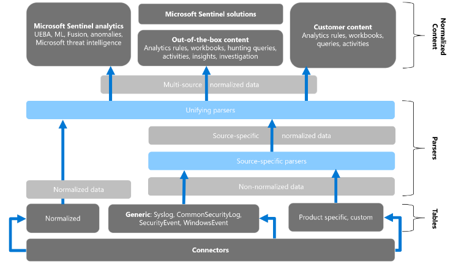
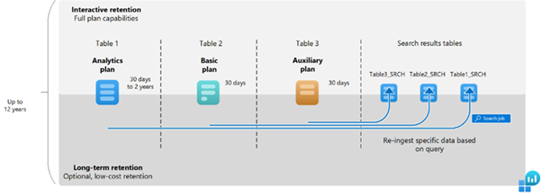

# Best Practices: Log Management for Microsoft Sentinel

## Executive Summary

Effective log management enables organisations to detect threats, ensure
compliance, and optimise operational resilience. This Log Management
Best Practices for Microsoft Sentinel provides comprehensive guidance
for security specialists, government agencies, and professionals in
security-related roles to maximise the capabilities of Microsoft
Sentinel (SIEM) platform. It outlines strategic approaches for managing
log ingestion, retention, search, cost, and source configurations within
Sentinel's Log Analytics Workspace.

The guide recommends the ingestion management strategies by prioritising
high-value log sources, such as identity systems and network devices,
while applying granular filtering to minimise irrelevant data. It
includes recommendations from ASD for priority log collection. It
incorporates key categories such as authentication, endpoint, network,
cloud activity, and email security to support detection and compliance
outcomes.

Retention policies should balance regulatory requirements, such as local
and federal government mandates, with operational needs, leveraging
tiered storage and archiving for efficiency. Search practices are
optimised through precise Kusto Query Language (KQL) queries and
proactive analytics rules to enhance incident response.

Cost management strategies include monitoring usage, selecting
appropriate storage tiers, and conducting regular reviews to align with
budgetary constraints. Additionally, log source management emphasises
separate workspaces for security and operational logs, role-based access
controls, and continuous monitoring to maintain data integrity and
compliance.

Implementing these practices enables organisations to enhance their
cybersecurity resilience, streamline adherence to national and global
regulatory requirements, and optimise resource utilisation. This
document offers a valuable framework for security teams and government
institutions seeking to safeguard vital infrastructure while upholding
operational efficiency in an ever-evolving threat environment.

## Audience and the objective

This guide is designed for security specialists, government agencies,
and professionals in security-related roles responsible for managing and
securing IT environments.

Its objective is to provide structured, actionable guidance on
optimising log ingestion, retention, search, cost, and source management
within Microsoft Sentinel's Log Analytics Workspace.

By offering practical strategies, the document aims to empower
organisations to enhance their cybersecurity resilience, ensure
compliance with national and international standards, and manage
resources efficiently, thereby safeguarding critical infrastructure in a
dynamic threat landscape.

## Scope

Log management covers a wide range of practices across different
platforms and data sources. This guide focuses specifically on log
management within the context of Microsoft Sentinel. It outlines best
practices in the following key areas:

- Data source identification

- Collection and ingestion management

- Retention management

- Cost management

- Data security

The Azure Well-Architected Framework offers guiding principles to help
improve the quality, reliability, and security of workloads. This guide
follows its five pillars to support best-practice log management in
Microsoft Sentinel.

1.  Reliability

2.  Security

3.  Cost Optimisation

4.  Operational Excellence

5.  Performance Efficiency

Implementing the key practices outlined in the following subsections
will enable security specialists and government agencies to ensure a
secure and compliant environment.

## Data source identification

Identifying the right data sources is a key step in setting up an
effective log management strategy in Microsoft Sentinel. Choosing the
correct sources ensures that important activities across the environment
are visible and can be monitored for threats, compliance, and
operational insights.

Microsoft provide three types of log types including recently
introducing Auxiliary logs. Refer to [Appendix: Log Type and
Usage](#_Appendix:_Log_types) for more information.

### Identify and prioritise data sources

Choosing and prioritising the right data sources is a key step in
effective log management and keep systems safe and meet compliance
requirements. Not all logs hold the same value, and prioritising what to
ingest first helps ensure visibility over the most important systems,
supports compliance, and manages costs effectively.

1.  Focus on high-risk, high-value and fast rotating logs that provide
    early visibility into security events. These include firewall deny
    logs, VPN activity, and intrusion alerts, which offer critical
    insight into potential threats and are often lost quickly if not
    collected in real time. Prioritising these logs supports effective
    threat detection and compliance without unnecessary cost.

2.  Begin with default security logs, especially those that cover
    authentication, usage of privileged accounts, and endpoint alerts.
    These are key for both real-time monitoring and investigation.

3.  Prioritise native connectors like Azure Activity for Azure
    operations, Microsoft Entra ID (Azure AD) for user login tracking,
    Microsoft 365 Defender for threat alerts, and Defender for Endpoint
    for device protection, as these provide critical security insights
    with minimal or no cost.

4.  Include additional sources like firewalls network alerts, VPN logs
    for remote access visibility and system logs from both Windows and
    Linux servers, whether hosted in Azure or on-premises. For Windows,
    prioritise Security event logs (e.g. logon attempts, group changes).
    For Linux, focus on logs relevant to authentication and access
    control, such as auth.log and SSH login events. Consider logs from
    third-party security tools and network virtual appliances (NVAs).
    When including system logs, make sure to separate security-relevant
    data from general performance or operational logs to avoid
    unnecessary ingestion

5.  Consider high-value third-party logs that can improve visibility and
    support deeper investigations, such as:

    - Email security gateway logs (e.g. Defender for Office 365, Proofpoint)
    
    - Web proxy or filtering logs
    
    - NetFlow data for network traffic analysis
    
    - DNS query logs for identifying access to malicious domains
    
    - Application security logs from web application firewalls
    
    > These logs are especially useful when looking into phishing attempts,
    > data exfiltration, or lateral movement. However, depending on the
    > solution in use, custom integration might be needed to bring them into
    > Microsoft Sentinel.

6.  Prioritise Azure AD sign-in logs and high-value Windows event logs
    such as Event IDs 4624 (successful logon), 4625 (failed logon), and
    4672 (privileged logon) for user monitoring and Syslog high-severity
    alerts for threat detection, while avoiding system performance logs
    with low security value. Using Sentinel's data connectors and Data
    Collection Rules (DCR), this targeted approach ensures only
    high-priority logs are collected, supporting security analytics,
    compliance and cost savings by excluding unnecessary data.

7.  Avoid collecting operational logs that are only for system health or
    performance, as these can increase costs and fill your workspace.
    Examples include Windows logs like System or Application, and Linux
    logs such as /var/log/syslog, which mainly record routine service
    status messages. Focus on logs that support threat detection,
    compliance, or incident response.

8.  Consider the importance of the system generating the logs, not just
    the log type. Some systems such as domain controllers, identity
    providers, firewalls, and mail gateway, play a more critical role in
    security operations.

    > Refer to the [Appendix: System priority for log
    > collection](#appendix-system-priority-for-log-collection) for a
    > suggested order of log source onboarding based on system importance,
    > informed by practitioner guidance.

9.  Consider going beyond conventional sign-in or admin logs and include
    logs that capture cloud API activity and short-lived cloud
    resources. Sentinel can ingest these logs through native connectors
    like Azure Activity, Microsoft Entra ID, and resource-specific
    diagnostic settings. This visibility is critical, as real-world
    incidents, like SolarWinds Incident, have shown that attackers may
    use cloud APIs to create users, escalate privileges, or deploy
    resources -- without appearing in standard administrative audit
    trails.

    Recommended cloud log types to prioritise in Sentinel include:
    
    - Authentication and role changes from Microsoft Entra ID logs
    
    - Azure Resource Manager activity and policy modifications from Azure
      Activity logs
    
    - Cloud API events, such as provisioning, scaling, and service-level
      changes
    
    - Lifecycle events of short-lived resources, such as VMs or containers
    
    - Audit and compliance logs, including access to storage accounts or key
      vaults
    
    - Application-level logs, capturing system or config changes at the
      app/service level
    
    > Ingesting these logs into Sentinel enables security teams to detect
    > cloud-native attack techniques, monitor misconfigurations, and support
    > post-incident investigation across cloud workloads.
    
    > Refer to the [Appendix: Log source details](#appendix-log-sources) to prioritise the data sources.

### Security logs

Security logs capture critical events that help protect, monitor, and
maintain the integrity of IT systems. They capture activities such as
user authentications, access attempts, firewall alerts, and threat
indicators across networks, endpoints, and applications.

The primary purpose of security logs is to support threat detection,
incident response, and compliance auditing, giving organisations clear
visibility into security-related activities and helping safeguard their
assets.

> Refer to [Appendix: Log types](#_Appendix:_Log_types) and [Appendix: Log categories (#appendix-system-priority-for-log-collection) for recommended security log use cases, categories and purpose.

### Operational logs

Operational logs record information about the performance, health, and
routine activities of IT systems, applications, and infrastructure such
as server uptime, application performance metrics, and database
transactions. These logs mainly support system monitoring,
troubleshooting, and optimisation, helping IT teams maintain system
efficiency and identify performance issues early. Key benefits of
operational logs include improved system reliability, better user
experience, and informed capacity planning.

However, it is generally not recommended to ingest operational logs into
Microsoft Sentinel's Log Analytics Workspace. Ingesting large volumes of
non-security data can increase costs unnecessarily and affect the
performance of security analytics.

Following the Cost Optimisation pillar of the Azure Well-Architected
Framework, it is important to store operational logs in a more
cost-effective platform, while keeping Sentinel focused on security and
compliance needs.

> Further strategies for managing ingestion and controlling costs will be discussed strategies in [Collection and ingestion management](#collection-and-ingestion-management) and [Cost management](#_Cost_management)

## Collection and ingestion management

Ingestion management is a vital part of Microsoft Sentinel's log
management, focusing on the careful collection and integration of log
data into the Log Analytics Workspace to strengthen security and meet
compliance needs.

It is recommended to configure log ingestion so that only the most
relevant logs-such as Azure AD sign-in logs for user monitoring and
Syslog high-severity alerts for threat detection are collected in
Microsoft Sentinel.

Once data sources are ingested into Microsoft Sentinel, it is important
to enable threat detection capabilities by installing relevant analytics
rules. These are available via the Content Hub, where out-of-the-box
rule templates can be deployed for various log sources. Without these
rules, ingested data may not trigger any alerts.

For deeper investigations and correlation beyond alerts, custom KQL
queries can be used to explore the ingested data and identify patterns
or suspicious behaviours that automated rules may not catch. This
ensures both proactive detection and reactive investigation are
supported as part of the log management lifecycle. It supports effective
threat detection and incident response while helping control costs and
reduce unnecessary data.

Figure 1: Collection and ingestion of different type of logs

### Filtering at the Source

In general, filtering improves cost efficiency and performance by
focusing on high-value security logs.

1.  Configure Data Collection Rules (DCR) within Microsoft Sentinel's
    data connectors to exclude non-essential data, such as routine
    operational logs or informational events, before ingestion into the
    Log Analytics Workspace.

2.  DCRs enable precise filtering by defining which log types or events
    are collected, reducing data volume, lowering storage and processing
    costs, and improving query performance.

3.  Use DCRs to filter out low-value logs before they enter Sentinel

4.  Only collect logs that help with security, incident response, or
    compliance including identity activity, firewall and VPN traffic,
    endpoint alerts, and privileged account usage. In addition to
    alert-generating logs, prioritise logs essential for investigations
    -- such as specific process creation events (4688), DNS and proxy
    logs, Active Directory changes (5136), and account lifecycle actions
    (4720-4726). These enable deeper threat hunting, forensics, and root
    cause analysis in addition to automated or scheduled alerting.

This targeted approach ensures that analysts can focus on
security-relevant information, enhancing the effectiveness of threat
detection and compliance monitoring.

Refer to the [Appendix: Windows Event ID
recommendation](#appendix-windows-event-id-summary) to include and
exclude using the DCR query. This list includes recommendations from
[ASD: Priority logs for SIEM
ingestion](https://www.cyber.gov.au/resources-business-and-government/maintaining-devices-and-systems/system-hardening-and-administration/system-monitoring/implementing-siem-and-soar-platforms/priority-logs-for-siem-ingestion-practitioner-guidance).

### Data normalisation 

Normalised data makes it easier to search, link events, and run
analytics, helping you find threats faster and respond more effectively.

Microsoft Sentinel enables both query-time and ingest-time data
normalisation, commonly through the use of the Azure Sentinel
Information Model (ASIM) parsers, providing organisations with the
flexibility to leverage the benefits of both approaches.

**Query-time normalisation offers several advantages:**

- Security: By preserving the original data format without modification,
  it ensures that all raw data remains intact, enabling accurate and
  reliable threat detection.

- Operational Excellence: It avoids duplicate storage by presenting a
  normalised view rather than storing separate copies of the data,
  reducing complexity.

- Performance Efficiency: Query-time normalisation allows parsers to be
  developed, tested, and refined without altering existing data,
  enabling fast updates that automatically apply to historical data.

- Cost Optimisation: It reduces storage and resource costs by
  eliminating the need for duplicate data storage.

**Ingest-time normalisation also offers some benefits:**

- Transforms and stores the data at the point of ingestion, ensuring
  immediate consistency across all logs.

- While it can enhance data uniformity for security analysis, this
  approach often leads to higher storage and processing costs.

Figure 2:  [Microsoft ASIM Normalisation](https://learn.microsoft.com/en-us/azure/sentinel/media/normalization/asim-architecture.png)

**Implement Best Practices:**

- Use ASIM parsers for standardised data models across different
  security tools.

- Implement field mapping to ensure consistent naming conventions.

- Create custom parsers for proprietary log formats.

- Test normalisation rules thoroughly before production deployment.

- Maintain accurate timestamps across all data sources.

**General advise,**

- Normalised data makes it easier to search, link events, and run
  analytics, helping you find threats faster and respond more
  effectively.

- When all log data is in the same format, security teams can quickly
  spot attack patterns and link related incidents, even if the data
  comes from different sources.

This helps them detect threats and respond more quickly, making their
threat hunting and investigations much convenient

### Track and optimise ingestion

- Regularly reviewing ingestion metrics in Microsoft Sentinel's Log
  Analytics Workspace is key to ensuring smooth, secure, and
  cost-effective data processing.

- Tracking unusual patterns, such as sudden spikes in Azure AD sign-in
  logs or Syslog alerts, helps identify potential security threats or
  misconfigured connectors quickly, enhancing threat detection and
  response.

  - For example, consistent surges in VPN or DNS logs could reflect
    failed sign-ins or beaconing activity. Monitor log ingestion
    regularly to spot spikes or issues early. This helps maintain fast
    performance and reliable threat detection.

  - Investigate ingestion spikes promptly to maintain performance and
    avoid excess data storage.

- After reviewing ingestion trends and identifying noise or unnecessary
  data, use Data Collection Rules to filter out low-value logs to filter
  and ingest into the Sentinel. Review and adjust what you collect as
  your needs change.

- Ensuring only essential logs are ingested keeps storage costs low and
  system resources focused on what matters.

- Adjust log collection policies as the environment evolves. New
  services or applications may introduce different threats and change
  your detection requirements.

This approach supports efficient, secure, and cost-effective log
management.

### Ingestion delay mitigation

Scheduled analytics rules are designed to run at regular intervals,
typically every five minutes, with a default look-back period of five
minutes. However, each data source may experience its own ingestion
delay, causing a gap between when events are generated and when they are
ingested into Sentinel. This delay can result in missed detections if
the events fall outside the scheduled query's look-back window.

To mitigate this, it is important to understand the ingestion delay for
each data source. The KQL can be used to calculate the difference
between the time generated and the time ingested. This allows the
look-back period to be adjusted accordingly.

Adjusting scheduled queries to handle ingestion delays supports Security
by ensuring no threat is missed, even with data delays.

Figure 3: Microsoft Ingestion delay problem

Figure 4: Microsoft Ingestion delay resolution

For critical use cases, it\'s worth considering near real-time
monitoring with Microsoft Sentinel\'s streaming analytics rules or
Microsoft Defender XDR alerts. These can send high-priority detections
into Sentinel almost instantly, helping catch and escalate urgent
threats without waiting for the next scheduled rule to run.

### Avoid Single Point of Failure

A risk occurs when only one log collector (like a server or agent) is
used to gather and send logs from your systems to Microsoft Sentinel or
another security platform. If that single collector fails, important log
data can be lost. Here are some key points to consider.

- For third-party data collection in Microsoft Sentinel, avoiding a
  single point of failure in log collectors is crucial to ensure
  continuous and secure log ingestion from sources like Syslog or
  CommonSecurityLog.

- Deploying multiple log collectors, such as Azure Monitor Agent
  instances or Syslog servers, across different Azure regions or
  on-premises environments prevents disruptions if one collector fails.

- This approach prevents disruptions in log collection if one collector
  fails due to network issues or hardware problems.

- For example, configure redundant Syslog collectors to forward
  high-severity alerts to the Log Analytics Workspace, using load
  balancing to distribute data.

- Regularly monitor collector health with Azure Monitor and test
  failover processes to ensure logs are always available, strengthening
  the cybersecurity setup, as detailed in the following practices.

Figure 5: VMSS architecture for redundant log collectors

This setup is especially important for critical security logs where
missing data could mean missing an attack. It ensures you don't lose
important security data in that scenario.

### Log Quality and Integrity Considerations

To make sure logs are useful for detecting threats and supporting
investigations, it\'s important to focus on the quality and consistency
of the data being collected into Microsoft Sentinel.

- **Collect sufficient details:** Logs should include key information
  like usernames, IP addresses, process names, and actions taken. Logs
  without this context often can't help during investigations or
  incident reviews.

- **Maintain accurate timestamps:** Use the same time source across all
  systems (like NTP). This helps keep logs aligned across different
  sources and avoids confusion when reviewing incidents.

- **Implement log correlation capabilities:** Use Sentinel's native
  correlation features such as analytics rules, entity mapping, and
  custom KQL joins to connect related events across sources (e.g. a
  failed login followed by a suspicious process). This helps detect
  threats earlier and speeds up investigations.

- **Preserve chain of custody:** When handling logs for regulatory or
  legal investigations, ensure logs are retained in tamper-proof storage
  (e.g. Log Analytics immutable retention) and that access to logs is
  controlled and auditable. Use Sentinel\'s access control (RBAC) and
  audit logs to track who accessed or modified log configurations.

These considerations support integrity, reliability, and investigative
value across all collected data in Sentinel.

## Retention management

Retention management is a key part of log management, ensuring data is
kept for the right amount of time to meet security and compliance needs.
It involves setting retention periods for different logs in Microsoft
Sentinel, based on regulatory requirements, company policies, and
operational needs.

A well-defined retention policy helps balance long-term data storage for
analysis, threat detection, and incident response, while optimising
storage costs and reducing the risk of data breaches by safely deleting
outdated or irrelevant data.

Retaining critical logs, such as Azure AD sign-in logs or
CommonSecurityLog alerts, ensures they are available for threat
detection and incident investigations.

Maintaining fast query performance depends on keeping the workspace free
from unnecessary data. The following practices help organisations set
the right retention periods, monitor storage use, and automate retention
policies. This approach keeps the cybersecurity setup secure and
cost-effective.

- **Set Retention Periods Based on Log Criticality**: Configure
  retention in the Log Analytics Workspace to keep security logs, such
  as Syslog alerts or CommonSecurityLog, for 90--365 days to support
  analytics rules and threat investigations. Where operational logs are
  required, limit their retention to 30 days to save costs. Use the
  Azure portal to adjust settings, ensuring critical logs remain
  accessible while minimising storage needs.

    > *Note: Operational logs used purely for system health or performance
    > monitoring aren\'t recommended for ingestion into Microsoft Sentinel.
    > If they\'re needed for a specific use case, keep their retention
    > period short -- ideally just 7 to 14 days.*
    >
    > *ASD guidance suggests a minimum of 90 days for authentication logs
    > and 180 days for host activity to support forensic investigations.*

- **Use Interactive and Archive Tiers**: Store frequently queried logs,
  like Azure AD sign-in logs, in the Interactive tier for 90 days to
  enable quick analytics. Move older logs to long-term retention or
  Archive tier for long-term, low-cost storage, such as retaining
  CommonSecurityLog for up to 1 year for historical analysis. An example
  of this is that a high volume firewall log would fall under the Basics
  plan as it is much more expensive to retain in the Analytics plan.
  Configure tiers in the Azure portal to balance access and cost.

- **Monitor Storage Usage**: Regularly check storage consumption using
  KQL queries to identify logs taking up excessive space. Adjust
  retention periods if security or cost needs change, for example,
  extending Syslog retention during a threat investigation. Use Azure
  Cost Management to track storage expenses and keep budgets in check.

- **Use the Microsoft Sentinel Optimization Workbook**: It is available
  through the Content Hub to monitor and improve your workspace. It
  includes three sections: Cost and Ingestion Optimisation, Operational
  Effectiveness, and Management and Acceleration, helping you identify
  areas to reduce costs and streamline operations.

- **Automate Retention Policies**: If Azure Log Analytics are available,
  apply Azure policies to enforce retention settings across workspaces,
  such as retaining Azure AD sign-in logs for 90 days and archiving
  AzureActivity after 30 days. Use Azure Monitor to ensure policies are
  followed, reducing manual work and ensuring consistency. Automation
  keeps retention efficient and secure.\
  *Note: For smaller agencies or setups with just one workspace,
  automation might not be needed. In such cases, setting retention
  manually could be easier and more suitable for the environment.*

    >Refer to [Appendix: Retention options](#appendix-retention-options) to
    >understand the available options for sentinel log retention

## Cost management

Controlling expenses for log ingestion, retention, and search queries,
organisations can maintain robust threat detection without overspending.

>Refer to [Appendix: Log sources](#appendix-log-sources) for data
>connectors, Microsoft benefits, billable and non-billable data ingestion.

>Refer to [Appendix: Sentinel Pricing
>Tiers](#appendix-sentinel-pricing-tiers) to understand the different options available

### Ingestion cost management

Managing ingestion costs start with focusing on collecting only the most
valuable logs and filtering out unnecessary data before it enters your
workspace. This approach helps control expenses and keeps your security
monitoring effective.

Key recommendations for managing ingestion cost:

- **Prioritise high-value logs:** Prioritise high-value logs, such as
  Azure AD sign-in logs, Endpoint or Syslog high-severity alerts, and
  limiting low-value logs, like system performance data, organisations
  can reduce storage and processing expenses in the Log Analytics
  Workspace.

- **Balance cost and value:** Cost-saving measures should never reduce
  your ability to detect threats. Always focus on collecting and
  analysing critical logs needed for security analytics and incident
  response.

- **Limit low-value logs:** Avoid ingesting logs like system performance
  data or routine operational logs, as they add cost without much
  security benefit.

- **Use Data Collection Rules (DCRs):** Set up DCRs to filter out
  routine or low-priority logs before they are ingested into Sentinel.
  Use DCRs to only ingest Syslog alerts with high severity, filtering
  out routine or low-value logs that do not add to your threat
  detection. This approach helps you avoid unnecessary data costs while
  keeping your security monitoring strong.

- **Use basic logs for high-volume, low-priority data:** Where possible,
  use the basic log type instead of analytics logs for data that is not
  needed for advanced security analytics.

This strategy keeps your log management affordable, efficient, and
focused on what matters most for security.

### Retention cost management

Managing retention costs by setting shorter retention periods for less
important logs and archiving critical logs to lower-cost storage to keep
your system secure and your expenses under control.

Key recommendations for managing retention cost:

- **Archive critical logs:**\
  For important logs such as Azure AD sign-in logs or CommonSecurityLog
  alerts, keep them in the Interactive tier for 90 days, then move them
  to the Archive tier for long-term, low-cost storage.

- **Balance compliance and cost:**\
  Make sure you meet any legal or business rules for keeping data. For
  example, keep security logs in analytics logs for at least 180 days,
  then move them to long-term storage if needed for compliance.

- **Use table-level retention settings:**\
  Set different retention times for each table in your Log Analytics
  Workspace. This helps you control both storage and costs more closely.

- **Automate retention policies:**

    > Use Azure Policy or built-in automation to apply and enforce retention
    > rules, so old logs are deleted or archived without manual work.\
    > *Note: For smaller agencies or organisation with just one workspace,
    > automation might not be needed. In such cases, setting retention
    > manually could be easier and more suitable for the environment.*

- **Separate retention policies:** Set the right retention time for each
  type of data, depending on your compliance needs and how often you use
  the data. Microsoft Sentinel lets you keep data for up to 730 days.
  You can also set different retention times for each table, which helps
  you control both data storage and costs more closely.

## Data security 

Ensuring the security of log data within Microsoft Sentinel is crucial
for maintaining the integrity of security operations and compliance with
organisational policies. This involves implementing granular access
controls, configuring appropriate data retention policies, and adhering
to best practices for workspace management.​

### Access Control Measures

Use Azure Role-Based Access Control (RBAC) to manage permissions at both
the workspace and table levels. This allows organisations to enforce the
principle of least privilege, ensuring users have access only to the
data necessary for their roles.​

- **Workspace-Level Access**: Permissions can be assigned to users or
  groups to grant access to the entire workspace, facilitating broad
  administrative capabilities when necessary.​

- **Table-Level Access**: For more granular control, permissions can be
  set at the table level, restricting access to specific datasets. This
  is particularly useful for segregating sensitive data and ensuring
  that only authorised personnel can access certain log types. ​

<!-- -->

- **Implement Least Privilege Access**: Assign users only the
  permissions necessary for their roles, utilising table-level access
  controls where appropriate.​

- **Regularly Review Access Permissions**: Conduct periodic audits of
  user permissions to ensure they align with current organisational
  roles and responsibilities.​

- **Monitor Data Access and Usage**: Utilise Azure Monitor and
  Sentinel\'s auditing capabilities to track access patterns and detect
  any anomalies or unauthorised access attempts.​

### Data Protection Measures

- **Ensure encryption of log data in transit and at rest:** Sentinel
  uses Azure platform encryption by default, but make sure TLS is
  enforced for all data being forwarded from external collectors or
  hybrid sources.

- **Implement network security controls on log collectors:** If using
  on-prem log forwarders or custom agents, restrict inbound traffic with
  NSGs or firewalls, and limit communication only to trusted endpoints
  like the Azure Monitor ingestion point.

- **Use secure communication protocols for all log forwarding:** Always
  forward logs using secure channels such as Syslog over TLS or
  HTTPS-based APIs, especially for third-party or custom connectors.

- **Log all administrative actions performed within Sentinel:** Ensure
  that changes to analytics rules, connectors, workbooks, and retention
  settings are tracked using Azure Activity Logs or Microsoft Entra
  audit logs.

It\'s important to note that certain built-in roles, such as Reader or
Contributor, may override table-level access controls. Therefore,
careful assignment of roles is crucial to maintain the desired security
posture.​​

### Hosting Azure Log Data

The Queensland Government Enterprise Architecture (QGEA) offers guidance
for agencies considering cloud services:

- **Data Sovereignty and Residency:** Government agencies need to make
  sure cloud providers can keep data stored within Australia to meet
  legal and regulatory rules.

- **Information Security Policy (IS18:2018):** Agencies have to set up
  an Information Security Management System (ISMS) based on ISO 27001 to
  keep information secure, trustworthy, and accessible.

- **Cloud Strategy:** The Queensland Government's cloud strategy pushes
  agencies to use cloud services, but they need to carefully check and
  handle risks, especially around keeping data secure and private.

To align with Queensland Government guidelines:

- **Select Australian Regions**: When you're setting up Azure Log
  Analytics workspaces or Microsoft Sentinel, select Australian regions
  like Australia East or Southeast to keep data stored within the
  country.

- **Implement ISMS**: Set up and keep an Information Security Management
  System based on ISO 27001 to handle security risks well.

## Appendix: Qualification checklist

Use this checklist to assess if your log management setup in Microsoft
Sentinel aligns with the best practices outlined in this guide and by
Microsoft. Each item is actionable and can be validated during design,
deployment, or operations.

|  | **Qualification** | **Status** |
|-------|---------------------------------------------------------|--------|
| 1 | Have you listed and prioritised your most important log sources (like Azure AD sign-ins, firewall alerts)? |  |
| 2 | Are you filtering out logs that are not useful for security or compliance? |  |
| 3 | Are you using Data Collection Rules (DCRs) to control what is ingested? |  |
| 4 | Do you review log ingestion regularly for spikes or unexpected data? |  |
| 5 | Are logs normalised for easier searching, correlation and analysis? |  |
| 6 | Do you monitor for delays in log ingestion and adjust queries if needed? |  |
| 7 | Do you have more than one log collector to avoid single points of failure? |  |
| 8 | Is collector health monitored, and are failover processes tested regularly? |  |
| 9 | Are retention periods set based on how important each log is? |  |
| 10 | Are you using both Interactive and Archive tiers to balance access and cost? |  |
| 11 | Is long-term retention (archive) used for logs needed for compliance but not frequent access?? |  |
| 12 | Have you considered either query-time or ingest-time normalisation approaches? |  |
| 13 | Is access to logs controlled with RBAC and reviewed regularly? |  |
| 14 | Are your log management processes documented and updated? |  |

## Appendix: Log Type and Usage

Microsoft Sentinel offers tools to monitor and manage data ingestion
volumes, which helps keep log storage and analysis costs under control.
It collects different types of logs, so understanding what's being
ingested is key to managing costs effectively.

Figure 6: Microsoft Log Analytics Workspace Retention

### Analytics Logs

Analytics logs in Microsoft Sentinel support all data types, providing
comprehensive analytics, alerting capabilities, and unrestricted
querying. These logs contain high-value security data that offer
insights into the status, usage, security posture, and performance of
your environment. Proactive monitoring of Analytics logs, combined with
scheduled alerts and analytics, is essential for effective security
detection and response.

### Basic Logs

Basic Logs tend to be more detailed and include a lot of high-volume
data with lower security value compared to Analytics Logs. They're not
typically used for advanced analytics or alerts but are handy for
on-the-spot queries, investigations, and searches when needed.

### Auxiliary Logs (Preview)

Auxiliary Logs in Microsoft Sentinel are high-volume, low-fidelity logs,
like network and firewall logs, that play an important role in security
investigations, threat hunting, and providing extra context during an
attack. This feature is currently in preview, and billing hasn't started
yet.

## Appendix: System priority for log collection

The following table is based on ACSC [practitioner
guidance](https://www.cyber.gov.au/resources-business-and-government/maintaining-devices-and-systems/system-hardening-and-administration/system-monitoring/implementing-siem-and-soar-platforms/priority-logs-for-siem-ingestion-practitioner-guidance#_ftn105)
and outlines a typical priority order for system types when planning log
onboarding for Microsoft Sentinel solutions. This priority order can be
used alongside other considerations to build a final plan for onboarding
of logs.

Organisations can use this priority as a guide when onboarding systems
into Sentinel, especially when full log centralisation is not yet in
place. This will directly support incident response capabilities by
ensuring the right data is available when security incidents occur.

| **Priority Order** | **System Type** | **Reason for Priority** |
|:-------:|------------------------|---------------------------------------|
| 1 | Identity providers (e.g. Entra ID, ADFS) | Capture sign-ins, SSO activity, and federation behaviours critical for attack detection |
| 2 | Domain Controllers | Core source of authentication, privilege escalation, and user activity logs |
| 3 | Firewalls and VPN gateways | Network visibility; detect policy violations, remote access, and perimeter anomalies |
| 4 | Email gateways | High-value logs for detecting phishing, malware, and email-based threats |
| 5 | Endpoint security platforms | Provide real-time alerts and telemetry for malware, behaviour, and isolation events |
| 6 | Critical application servers | Detect configuration tampering, unauthorised access, or sensitive data exposure |
| 7 | Perimeter servers | Detect initial access to servers easily accessible from the internet or a VPN. |
| 8 | File, database servers and other storage | Important for monitoring access to shared resources and potential data exfiltration. Process execution and file system changes. Database access and modification logs |
| 9 | All other systems | Detect broader compromise across the network and perform environment-wide threat hunting. |

## Appendix: Log categories

The following table outlines commonly identified data sources that are
recommended for ingestion into Microsoft Sentinel to support visibility,
threat detection, and incident response.

| **Category** | **Example Data Sources** | **Purpose** |
|-------------------|---------------------------|---------------------------|
| **Identity** | Microsoft Entra ID (Azure AD) Sign-in and Audit Logs | Monitor authentication and user activity |
| **Cloud Activity** | Azure Activity Logs, AWS CloudTrail, GCP Audit Logs | Track changes and operations in cloud services |
| **Endpoint Security** | Microsoft Defender for Endpoint, Antivirus Logs | Detect malware, suspicious activities, and endpoint risks |
| **Network Security** | Firewall Logs (Azure Firewall, Palo Alto, Fortinet), VPN Logs, Web Proxy or Filtering Logs, NetFlow Data / Network Flow Logs | Monitor traffic flows, blocked connections, and VPN access |
| **Threat Detection** | Microsoft 365 Defender, Microsoft Defender for Identity Alerts, Email Security Gateway Logs | Detect and respond to identity and email threats |
| **Application Security** | Microsoft 365 Audit Logs, Custom Application Logs, Web Server Logs | Track actions within business-critical applications |
| **Infrastructure** | Windows Event Logs, Linux Syslog | Monitor server-level operations and failures |
| **Threat Intelligence** | TI Platforms (e.g., Threat Intelligence Platforms, MISP) | Enrich alerts with external threat context |
| **Data Access** | Database storage (including SQL Server, Oracle and others) On-prem and Cloud file storage. | Database queries, file access, data transfers |

## Appendix: Windows Event ID Summary

| **Log Type** | **Key Event IDs** | **Why It Matters** |
|----------------|------------------------|---------------------------------|
| Logon/Authentication | 4624, 4625, 4648, 4672, 4768, 4769, 4776 | Core to user access tracking, threat detection |
| Account Lifecycle | 4720--4726, 4738, 4781, 4767 | Account creation, deletion, modification |
| Group Membership | 4728--4733, 4746--4762 | Detect privilege escalation and group changes |
| Endpoint Activity | 4688, 4103, 4104, 7045 | Track command and process execution |
| Directory Services | 5136, 5141 | Monitor AD object modifications or deletions |

## Appendix: Windows Event ID inclusion recommendation

<table>
<colgroup>
<col style="width: 5%" />
<col style="width: 10%" />
<col style="width: 11%" />
<col style="width: 7%" />
<col style="width: 38%" />
<col style="width: 25%" />
</colgroup>
<thead>
<tr>
<th><strong>Event ID</strong></th>
<th><strong>Event Name</strong></th>
<th><strong>Event Category</strong></th>
<th><strong>Event Severity</strong></th>
<th><strong>Recommendation</strong></th>
<th><strong>Purpose or Reason</strong></th>
</tr>
</thead>
<tbody>
<tr>
<td>21</td>
<td>Remote Desktop Session Logon</td>
<td>Authentication</td>
<td>Medium</td>
<td>
Sourced from the <em>Remote Desktop/Local Session
Manager/Operational</em> event log.

Enable for all systems where Remote Desktop is used or turned on.
Provides visibility into source IPs for RDP logons, which are not always
available in standard logon events (e.g. 4624).
</td>
<td>Detect unauthorised remote access and support lateral movement
investigations. Essential for detecting unauthorised access and
correlating remote activity.</td>
</tr>
<tr>
<td>23</td>
<td>Remote Desktop Session Logoff</td>
<td>Authentication</td>
<td>Medium</td>
<td>
Sourced from the <em>Remote Desktop/Local Session
Manager/Operational</em> event log.

Enable to track the end of RDP sessions. Useful for building session
timelines and identifying abnormal session durations. Best used in
combination with Event ID 21.
</td>
<td>Understand session flow and timing, useful in correlation with other
RDP events</td>
</tr>
<tr>
<td>24</td>
<td>Remote Desktop Session Disconnect</td>
<td>Authentication</td>
<td>Medium</td>
<td>
Sourced from the <em>Remote Desktop/Local Session
Manager/Operational</em> event log.

Enable to track the end of RDP sessions that have not been properly
terminated. Useful for building session timelines and identifying
abnormal session durations. Best used in combination with Event ID
21.
</td>
<td>Understand session flow and timing, useful in correlation with other
RDP events.</td>
</tr>
<tr>
<td>1102</td>
<td>Security Log Cleared</td>
<td>Audit Policy</td>
<td>Critical</td>
<td>Ingest to detect attempts to evade auditing, as clearing the
security log may hide malicious activity, critical for forensic
investigations and compliance with GDPR or national standards. Configure
DCR to capture this event across all systems.</td>
<td>Often linked to attacker attempts to erase evidence; monitor for
correlation with other suspicious events (e.g., 4624, 4672).</td>
</tr>
<tr>
<td>1104</td>
<td>Security Log Search Failure</td>
<td>Audit Policy</td>
<td>High</td>
<td>Collect to identify potential log tampering or access issues, which
could indicate attacks or system errors, supporting anomaly detection
and compliance auditing. Use DCR to ingest this event for all security
logs.</td>
<td>Rare in normal operations; investigate promptly to rule out system
issues or malicious intent.</td>
</tr>
<tr>
<td>1121</td>
<td>Windows Defender Threat Detected</td>
<td>Endpoint Security</td>
<td>Critical</td>
<td>Include to monitor real-time threat identification by Windows
Defender, such as malware detection, essential for incident response and
endpoint security. Configure DCR to collect from
Microsoft-Windows-Windows Defender/Operational log.</td>
<td>Includes details like threat name and file path, aiding rapid
response; high priority for SOC teams.</td>
</tr>
<tr>
<td>1122</td>
<td>Windows Defender Threat Removed</td>
<td>Endpoint Security</td>
<td>High</td>
<td>Ingest to track remediation efforts, verifying threat resolution by
Windows Defender, crucial for ensuring endpoint protection and
compliance. Use DCR to capture from Defender’s operational log.</td>
<td>Confirms mitigation success; cross-reference with 1121 to validate
threat lifecycle.</td>
</tr>
<tr>
<td>4103</td>
<td>PowerShell Command Line Activity</td>
<td>PowerShell Activity</td>
<td>Medium</td>
<td>Collect to capture commands executed via PowerShell. Helps track
administrative actions or suspicious behaviour. Recommended in
environments where PowerShell is commonly used for system changes,
automation, or remote management.</td>
<td>Useful for detecting unauthorised or risky PowerShell usage,
including command execution during attacks.</td>
</tr>
<tr>
<td>4104</td>
<td>PowerShell Script Block Logging</td>
<td>PowerShell Activity</td>
<td>High</td>
<td>
Collect to view script content during execution. Useful for
detecting malicious script behaviour.

<em>Note: Be cautious of high volume and potential noise. Filter or
sample based on investigation needs or use cases.</em>
</td>
<td>Essential for detecting and analysing malicious scripts, obfuscated
commands, and living-off-the-land attacks (LOLBins).</td>
</tr>
<tr>
<td>4624</td>
<td>Successful Logon</td>
<td>Authentication</td>
<td>High</td>
<td>Collect to monitor access patterns and detect unauthorised logins,
providing critical data for threat hunting and compliance with auditing
requirements. Configure DCR to ingest for all critical accounts and
devices.</td>
<td>Includes logon type (e.g., interactive, remote), useful for
distinguishing normal vs. suspicious access.</td>
</tr>
<tr>
<td>4625</td>
<td>Failed Logon</td>
<td>Authentication</td>
<td>High</td>
<td>Include to identify brute-force attacks or credential misuse, as
failed logins are key indicators of potential threats, supporting
proactive detection and compliance. Use DCR to capture for all
accounts. 
Note: Consider lower retention due to high volume</td>
<td>High volume in busy environments; correlate with 4740 (lockout) for
attack patterns.</td>
</tr>
<tr>
<td>4627</td>
<td>Group Membership Information</td>
<td>Authentication</td>
<td>Medium</td>
<td>Ingest to track group memberships during logon, which affect user
permissions, helping detect privilege misuse and supporting compliance
audits. Configure DCR to include for high-risk accounts.</td>
<td>Provides context for 4624; useful for auditing effective permissions
at logon.</td>
</tr>
<tr>
<td>4634</td>
<td>Logoff</td>
<td>Authentication</td>
<td>Low</td>
<td>
Collect selectively to correlate logon/logoff patterns for
anomaly detection, useful for security but high-volume. Configure DCR to
ingest only for privileged accounts to balance cost and monitoring
needs.

Note: Consider lower retention due to high volume
</td>
<td>High volume; filter to reduce noise, focusing on accounts with
elevated privileges.</td>
</tr>
<tr>
<td>4647</td>
<td>User-Initiated Logoff</td>
<td>Authentication</td>
<td>Low</td>
<td>Ingest selectively to track user behaviour, as explicit logoffs may
indicate normal or suspicious activity, but less critical. Configure DCR
to include for sensitive systems to optimise costs.</td>
<td>Less frequent than 4634; useful for specific behavioural analytics
scenarios.</td>
</tr>
<tr>
<td>4648</td>
<td>Explicit Credential Usage</td>
<td>Authentication</td>
<td>High</td>
<td>Collect to monitor privileged account usage, as explicit credential
use (e.g., Run As) can indicate misuse, critical for insider threat
detection and compliance. Use DCR to ingest for administrative
accounts.</td>
<td>Often tied to admin actions; monitor for unusual contexts like
non-admin systems.</td>
</tr>
<tr>
<td>4670</td>
<td>Permissions Changed</td>
<td>Access Control</td>
<td>High</td>
<td>Ingest to detect unauthorised access modifications, as permission
changes to objects like files are common attack vectors, supporting
compliance and security. Configure DCR to capture for critical
assets.</td>
<td>Includes object details (e.g., file path), aiding forensic analysis
of access changes.</td>
</tr>
<tr>
<td>4672</td>
<td>Security Group Membership Assigned</td>
<td>Access Control</td>
<td>High</td>
<td>Collect to monitor access control changes, as group assignments can
indicate privilege escalation, essential for security and compliance
audits. Use DCR to ingest for high-risk groups (e.g.,
Administrators).</td>
<td>Common in privilege escalation attacks; monitor alongside 5136 for
AD context.</td>
</tr>
<tr>
<td>4688</td>
<td>Process Creation</td>
<td>System Activity</td>
<td>Medium</td>
<td>Ingest selectively to detect malicious processes or lateral
movement, valuable for security but high-volume. Configure DCR to
include only processes from critical systems or suspicious users to
balance cost and threat detection. Consider different <a
href="#appendix-retention-options">retention options</a> mentioned in
this guide. 
Note: Consider lower retention due to high volume</td>
<td>Includes process name and parent process, critical for malware
analysis; high volume requires filtering.</td>
</tr>
<tr>
<td>4720</td>
<td>User Account Created</td>
<td>Account Management</td>
<td>Critical</td>
<td>Collect to audit account management and detect unauthorised account
creation, a common attack tactic, supporting compliance with national
standards. Configure DCR to ingest domain-wide.</td>
<td>Often a precursor to privilege escalation; monitor alongside 4722,
4723.</td>
</tr>
<tr>
<td>4722</td>
<td>User Account Enabled</td>
<td>Account Management</td>
<td>High</td>
<td>Ingest to track account activation, which could signal unauthorised
access, supporting security monitoring and compliance audits. Configure
DCR to capture for account lifecycle management.</td>
<td>May indicate attack recovery or misuse; verify with account
history.</td>
</tr>
<tr>
<td>4723</td>
<td>Password Change Attempt</td>
<td>Account Management</td>
<td>High</td>
<td>Collect to detect unauthorised password changes or insider threats,
as password change attempts are critical for security. Use DCR to ingest
for all accounts, especially privileged ones.</td>
<td>Includes user context; correlate with 4625 for suspicious
patterns.</td>
</tr>
<tr>
<td>4724</td>
<td>Password Reset Attempt</td>
<td>Account Management</td>
<td>High</td>
<td>Ingest to monitor administrative actions like password resets, which
could indicate compromise, supporting compliance and auditing. Configure
DCR to capture for all accounts.</td>
<td>Often performed by admins; monitor for unauthorised resets.</td>
</tr>
<tr>
<td>4725</td>
<td>User Account Disabled</td>
<td>Account Management</td>
<td>High</td>
<td>Collect to track account status changes, useful for detecting
security responses or attacks, supporting audit trails. Configure DCR to
ingest for compliance and monitoring.</td>
<td>May indicate defensive actions; verify context with 4740.</td>
</tr>
<tr>
<td>4726</td>
<td>User Account Deleted</td>
<td>Account Management</td>
<td>Critical</td>
<td>Ingest to audit account management and detect unauthorised
deletions, critical for security and compliance. Configure DCR to
capture for compliance and threat monitoring.</td>
<td>Rare in normal operations; investigate immediately for potential
attacks.</td>
</tr>
<tr>
<td>4728</td>
<td>User Added to Global Group</td>
<td>Group Management</td>
<td>High</td>
<td>Collect to monitor privilege changes, as adding users to global
groups can indicate escalation risks, supporting security and
compliance. Use DCR to ingest for sensitive groups.</td>
<td>Impacts domain-wide access; monitor alongside 4672.</td>
</tr>
<tr>
<td>4729</td>
<td>User Removed from Global Group</td>
<td>Group Management</td>
<td>Medium</td>
<td>Ingest to audit access control changes, as group removals are
relevant for compliance and security monitoring. Configure DCR to
capture for high-risk groups.</td>
<td>Less critical than additions but useful for audit completeness.</td>
</tr>
<tr>
<td>4732</td>
<td>User Added to Local Group</td>
<td>Group Management</td>
<td>High</td>
<td>Collect to monitor local privilege changes, a potential attack
vector, critical for security in sensitive systems. Use DCR to ingest
for critical systems.</td>
<td>Impacts system-level access; prioritize for servers and
endpoints.</td>
</tr>
<tr>
<td>4733</td>
<td>User Removed from Local Group</td>
<td>Group Management</td>
<td>Medium</td>
<td>Ingest to track permission changes, useful for compliance audits and
security monitoring. Configure DCR to capture for sensitive groups.</td>
<td>Supports audit trails; less urgent than additions.</td>
</tr>
<tr>
<td>4738</td>
<td>User Account Changed</td>
<td>Account Management</td>
<td>High</td>
<td>Collect to detect unauthorised account modifications, such as
privilege changes, critical for compliance and threat detection.
Configure DCR to ingest for all accounts.</td>
<td>Includes attribute changes (e.g., SAM name); monitor for
anomalies.</td>
</tr>
<tr>
<td>4740</td>
<td>Account Lockout</td>
<td>Authentication</td>
<td>High</td>
<td>Ingest to identify attack attempts or policy violations, as lockouts
indicate potential threats, supporting proactive monitoring and
compliance. Configure DCR to capture for all accounts.</td>
<td>Correlates with 4625; indicates aggressive attack behaviour.</td>
</tr>
<tr>
<td>4746</td>
<td>User Added to Domain Group</td>
<td>Group Management</td>
<td>High</td>
<td>Collect to monitor domain-level privilege changes, critical for
enterprise security and compliance. Use DCR to ingest for high-risk
groups.</td>
<td>Impacts enterprise access; similar to 4728 but domain-specific.</td>
</tr>
<tr>
<td>4751</td>
<td>User Removed from Domain Group</td>
<td>Group Management</td>
<td>Medium</td>
<td>Ingest to audit access changes, as domain group removals are
relevant for compliance and security. Configure DCR to capture for
sensitive groups.</td>
<td>Supports compliance; less critical than additions.</td>
</tr>
<tr>
<td>4752</td>
<td>User Added to Universal Group</td>
<td>Group Management</td>
<td>High</td>
<td>Collect to track privilege assignments across domains, critical for
security and compliance monitoring. Use DCR to ingest for high-risk
groups.</td>
<td>Affects cross-domain access; monitor for enterprise
environments.</td>
</tr>
<tr>
<td>4756</td>
<td>User Added to Universal Group</td>
<td>Group Management</td>
<td>High</td>
<td>Ingest to monitor privilege changes, as universal group additions
are critical for security and compliance audits. Configure DCR to
capture for sensitive groups.</td>
<td>Duplicate functionality with 4752; ensure consistent DCR
settings.</td>
</tr>
<tr>
<td>4757</td>
<td>User Removed from Universal Group</td>
<td>Group Management</td>
<td>Medium</td>
<td>Collect to audit permission changes, useful for compliance and
security monitoring. Configure DCR to ingest for high-risk groups.</td>
<td>Less critical than additions but completes audit trail.</td>
</tr>
<tr>
<td>4761</td>
<td>User Added to Domain Group</td>
<td>Group Management</td>
<td>High</td>
<td>Ingest to monitor privilege escalation risks, as domain group
additions are critical for enterprise security. Configure DCR to capture
for compliance.</td>
<td>Overlaps with 4746; ensure DCR avoids redundant ingestion.</td>
</tr>
<tr>
<td>4762</td>
<td>User Removed from Domain Group</td>
<td>Group Management</td>
<td>Medium</td>
<td>Collect to audit access changes, supporting compliance and security
monitoring in enterprise environments. Configure DCR to ingest for
sensitive groups.</td>
<td>Complements 4751; relevant for large-scale AD environments.</td>
</tr>
<tr>
<td>4767</td>
<td>User Account Unlocked</td>
<td>Account Management</td>
<td>High</td>
<td>Ingest to monitor administrative actions like account unlocks, which
could indicate attack recovery, supporting compliance auditing.
Configure DCR to capture for all accounts.</td>
<td>Often follows 4740; verify for legitimate admin actions.</td>
</tr>
<tr>
<td>4768</td>
<td>Kerberos Authentication Ticket Requested</td>
<td>Authentication</td>
<td>High</td>
<td>Collect to track Kerberos logins (TGT requests); essential for
detecting pass-the-ticket attacks. Use DCR to ingest for domain-joined
systems.</td>
<td>Core to AD authentication auditing; detect anomalies in account
use.</td>
</tr>
<tr>
<td>4769</td>
<td>Kerberos Service Ticket Requested</td>
<td>Authentication</td>
<td>High</td>
<td>Collect to monitor service ticket requests. Use DCR to collect for
privilege analysis or service abuse.</td>
<td>Useful in lateral movement and pass-the-ticket detection.</td>
</tr>
<tr>
<td>4771</td>
<td>Kerberos Pre-Authentication Failed</td>
<td>Authentication</td>
<td>High</td>
<td>Collect to detect credential attacks or misconfigurations, as failed
Kerberos attempts are key threat indicators, supporting proactive
monitoring. Use DCR to ingest for all systems.</td>
<td>Common in brute-force attacks; includes client details for
analysis.</td>
</tr>
<tr>
<td>4776</td>
<td>NTLM Authentication</td>
<td>Authentication</td>
<td>High</td>
<td>Ingest to track NTLM logins (e.g., legacy systems or fallbacks). Use
with 4624 for context.</td>
<td>Detect use of weaker authentication protocols or misconfigured
clients.</td>
</tr>
<tr>
<td>4781</td>
<td>Account Name Changed</td>
<td>Account Management</td>
<td>High</td>
<td>Ingest to detect unauthorised account modifications, as name changes
could hide malicious activity, critical for compliance and audits.
Configure DCR to capture for all accounts.</td>
<td>Rare in normal use; investigate alongside 4738.</td>
</tr>
<tr>
<td>4798</td>
<td>User’s Local Group Membership Enumerated</td>
<td>Reconnaissance</td>
<td>High</td>
<td>Collect to detect reconnaissance activities, as group enumeration is
a common attacker tactic, supporting anomaly detection and threat
hunting. Use DCR to ingest for security monitoring.</td>
<td>Indicates pre-attack planning; prioritise for threat hunting
rules.</td>
</tr>
<tr>
<td>4800</td>
<td>Workstation Locked</td>
<td>User Activity</td>
<td>Low</td>
<td>Ingest selectively to monitor user behaviour, as workstation locking
may indicate normal or suspicious activity, but high-volume. Configure
DCR to capture for privileged users only.</td>
<td>High volume; focus on admins to reduce ingestion costs.</td>
</tr>
<tr>
<td>4801</td>
<td>Workstation Unlocked</td>
<td>User Activity</td>
<td>Low</td>
<td>Collect selectively to track user activity, useful but less
critical, minimising ingestion costs. Configure DCR to ingest for
sensitive systems only.</td>
<td>Complements 4800; filter to avoid excessive data.</td>
</tr>
<tr>
<td>4964</td>
<td>Special Groups Logon</td>
<td>Authentication</td>
<td>Critical</td>
<td>Ingest to track high-privilege access, as special group logons are
critical for insider threat detection and compliance. Configure DCR to
capture for all systems.</td>
<td>Configurable for sensitive groups; high priority for SOC
monitoring.</td>
</tr>
<tr>
<td>5007</td>
<td>Windows Defender Configuration Changed</td>
<td>Endpoint Security</td>
<td>High</td>
<td>Collect to monitor endpoint security integrity, as Defender setting
changes (e.g., exclusions) could indicate compromise, supporting
compliance. Configure DCR to ingest from Defender’s operational
log.</td>
<td>Includes change details; monitor for unauthorised
modifications.</td>
</tr>
<tr>
<td>5136</td>
<td>Directory Service Object Modified</td>
<td>Active Directory</td>
<td>High</td>
<td>Ingest to audit Active Directory changes, a common attack target,
critical for detecting unauthorised modifications and ensuring
compliance. Configure DCR to capture domain-wide.</td>
<td>Includes object attributes; key for AD security audits.</td>
</tr>
<tr>
<td>5141</td>
<td>Directory Service Object Deleted</td>
<td>Active Directory</td>
<td>Critical</td>
<td>Collect to detect unauthorised Active Directory deletions, critical
for enterprise security and compliance with audit standards. Configure
DCR to ingest for all AD objects.</td>
<td>Rare in normal operations; prioritise for immediate
investigation.</td>
</tr>
<tr>
<td>5136</td>
<td>A directory service object was modified</td>
<td>Active Directory</td>
<td>High</td>
<td>Ingest to audit Active Directory changes, as modifications to
objects like users or groups are common attack targets, critical for
detecting unauthorised changes and ensuring compliance with GDPR or
national standards. Configure DCR to capture domain-wide.</td>
<td>Includes details like modified attributes (e.g., group membership,
user properties); key for AD security audits and compliance
reporting.</td>
</tr>
<tr>
<td>7045</td>
<td>New Service Installed</td>
<td>System Activity</td>
<td>High</td>
<td>Ingest to detect potential malware or unauthorised changes, as new
services are common attack vectors, supporting anomaly detection and
compliance. Configure DCR to capture for all systems.</td>
<td>Includes service details; monitor for unauthorised
installations.</td>
</tr>
</tbody>
</table>

## Appendix: Windows Event ID exclusion recommendation

| Event ID | Even Name | Event Category | Event Severity | Recommendation | Purpose or Reason |
|-----|---------|---------|---------|------------------------|-------------------|
| 4802 | Screensaver Invoked | User Activity | Informational | Exclude, as screensaver activation is operational with minimal security relevance, reducing ingestion volume and costs. Configure DCR to filter out this event. | No threat correlation; purely operational context. |
| 4803 | Screensaver Dismissed | User Activity | Informational | Exclude, as screensaver dismissal lacks security value and is operational, optimising workspace focus on threats. Configure DCR to filter out this event. | Minimal value; avoid maintaining cost efficiency. |
| 6005 | Event Log Service Started | System Health | Informational | Exclude, as event log service startup is operational (e.g., system boot) with minimal security value, optimising ingestion costs. Configure DCR to filter out this event. | Common during reboots; no direct security relevance. |
| 6013 | System Health Status | System Health | Informational | Exclude, as system health metrics (e.g., disk space) are operational, not security-related, reducing unnecessary ingestion. Configure DCR to filter out this event. | Better suited for IT monitoring tools, not Sentinel. |
| 7036 | Service Start/Stop | System Activity | Informational | Exclude, as service start/stop events are primarily operational, with limited security relevance unless tied to threats, minimising costs. Configure DCR to filter out this event. | High volume; include only if tied to specific threats (e.g., malware services). |

## Appendix: Log sources

### Data Connectors and tables

<table>
<colgroup>
<col style="width: 14%" />
<col style="width: 21%" />
<col style="width: 53%" />
<col style="width: 9%" />
</colgroup>
<thead>
<tr>
<th style="text-align: center;">
<strong>Data Connector /</strong>

<strong>Log Sources</strong>
</th>
<th style="text-align: center;"><strong>Sentinel Table</strong></th>
<th style="text-align: center;"><strong>Description</strong></th>
<th style="text-align: center;"><strong>Billable</strong></th>
</tr>
</thead>
<tbody>
<tr>
<td>Azure Activity</td>
<td>AzureActivity</td>
<td>Azure activity such as creation, modification, deletion of Azure
resources, policy updates.</td>
<td>No</td>
</tr>
<tr>
<td>Office 365</td>
<td>OfficeActivity</td>
<td>Office 365 activity: Exchange, SharePoint, DLP, OneDrive.</td>
<td>No</td>
</tr>
<tr>
<td>Sentinel Health data</td>
<td>SentinelHealth </td>
<td>Health data is collected in the SentinelHealth table, which captures
events that record each time an automation rule is run and the end
results of those runs.</td>
<td>No</td>
</tr>
<tr>
<td>Azure AD</td>
<td>AuditLogs</td>
<td>Azure AD activities audit such as creation/modification of users,
groups, applications.</td>
<td>Yes</td>
</tr>
<tr>
<td>Sentinel Audit data</td>
<td>SentinelAudit</td>
<td>User activities in Microsoft Sentinel, capturing details about
changes made to the environment and identifying the users responsible
for those changes.</td>
<td>Yes</td>
</tr>
<tr>
<td>AWS CloudTrail</td>
<td>AWSCloudTrail</td>
<td>AWS CloudTrail log entries.</td>
<td>Yes</td>
</tr>
<tr>
<td>Azure Resources</td>
<td>AzureDiagnostics</td>
<td>Storage of diagnostic logs for Azure resources.</td>
<td>Yes</td>
</tr>
<tr>
<td>Azure Resources</td>
<td>AzureMetrics</td>
<td>Provides storage of metrics recorded by various Azure
resources.</td>
<td>Yes</td>
</tr>
<tr>
<td>Security Devices</td>
<td>CommonSecurityLog</td>
<td>Logs from security devices logging via syslog using Common Event
Format (CEF).</td>
<td>Yes</td>
</tr>
<tr>
<td>Azure AD</td>
<td>ComputeGroup</td>
<td>Information on computer group membership.</td>
<td>Yes</td>
</tr>
<tr>
<td>Microsoft DNS</td>
<td>DnsEvents</td>
<td>Microsoft DNS events (registrations, configuration changes).</td>
<td>Yes</td>
</tr>
<tr>
<td>Microsoft DNS</td>
<td>DnsInventory</td>
<td>DNS logs recording DNS zone details.</td>
<td>Yes</td>
</tr>
<tr>
<td>Windows Event logs</td>
<td>Event</td>
<td>Windows event log entries (excluding security event logs).</td>
<td>Yes</td>
</tr>
<tr>
<td>MMA Agents</td>
<td>Heartbeat</td>
<td>Microsoft Monitoring Agent heartbeat.</td>
<td>No</td>
</tr>
<tr>
<td>MCAS</td>
<td>MCASShadowITReporting</td>
<td>MCAS Shadow IT information: records of access to applications
typically used in "shadow IT".</td>
<td>Yes</td>
</tr>
<tr>
<td>Azure Security Center (ASC)</td>
<td>ProtectionStatus</td>
<td>Azure Security Center records on endpoint protection solution
status.</td>
<td>Yes</td>
</tr>
<tr>
<td>AS, ASC, MCAS, ATP, ADP</td>
<td>SecurityAlert</td>
<td>Alert details (Sentinel, Security Center, MCAS, MDE, ATP, ADP).</td>
<td>Yes</td>
</tr>
<tr>
<td>Azure Security Center (ASC)</td>
<td>SecurityBaseline</td>
<td>Azure Security Center records related to monitored endpoints vs.
configured policies.</td>
<td>Yes</td>
</tr>
<tr>
<td>Azure Security Center (ASC)</td>
<td>SecurityBaselineSummary</td>
<td>Azure Security Center records with status of monitored endpoints
related to compliance.</td>
<td>Yes</td>
</tr>
<tr>
<td>Microsoft Defender ATP</td>
<td>SecurityDetection</td>
<td>Microsoft Defender ATP logs for potential security issues.</td>
<td>Yes</td>
</tr>
<tr>
<td>Windows Security Event log</td>
<td>SecurityEvent</td>
<td>Windows security event logs.</td>
<td>Yes</td>
</tr>
<tr>
<td>Azure AD</td>
<td>SigninLogs</td>
<td>Azure Active Directory sign-in logs.</td>
<td>Yes</td>
</tr>
<tr>
<td>Syslog-capable devices</td>
<td>Syslog</td>
<td>Logs from syslog devices.</td>
<td>Yes</td>
</tr>
<tr>
<td>Various TI sources</td>
<td>ThreatIntelligenceIndicator</td>
<td>Used for ingestion of threat intel data from supported providers
(MISP, MineMeld, etc.).</td>
<td>Yes</td>
</tr>
<tr>
<td>Microsoft Firewall Logs</td>
<td>WindowsFirewall</td>
<td>Microsoft Windows Firewall log entries.</td>
<td>Yes</td>
</tr>
</tbody>
</table>

### Log Sources available with Microsoft Benefit

| **Log Source** | Connector | **License** |
|----------------------------------|---------------------------|------------|
| Azure activity Logs | Azure Activity Connector | No Charge |
| Office 365 Audit Logs | Office 365 Connector | No Charge |
| Alerts from Microsoft Defender for Cloud | Microsoft Defender for Cloud Connector | E5 |
| Alerts from Microsoft 365 Defender | Microsoft Defender XDR Connector | E5 |
| Alerts from Microsoft 365 Defender for Office 365 | Microsoft Defender XDR Connector | E5 |
| Alerts from Microsoft Defender for Identity | Microsoft Defender XDR Connector | E5 |
| Alerts from Microsoft Defender for Endpoint | Microsoft Defender XDR Connector | E5 |
| Alerts from Microsoft Defender for Cloud Apps | Microsoft Defender XDR Connector | E5 |

### Non-Billable Data -- Sentinel

<table>
<colgroup>
<col style="width: 20%" />
<col style="width: 15%" />
<col style="width: 63%" />
</colgroup>
<thead>
<tr>
<th style="text-align: center;"><strong>Data Connector</strong></th>
<th style="text-align: center;">Log Type</th>
<th style="text-align: center;"><strong>Detail</strong></th>
</tr>
</thead>
<tbody>
<tr>
<td>Azure Activity</td>
<td>Log Only</td>
<td>The Azure Activity Log provides insights into subscription-level
events, including Azure Resource Manager operations, service health,
resource write operations, and activity status.</td>
</tr>
<tr>
<td>Microsoft 365 (formerly, Office 365)</td>
<td>Logs Only</td>
<td>
The Office 365 activity log connector offers insights into user
activities like file downloads and access requests. Integrating these
logs with Microsoft Sentinel allows for dashboards, custom alerts, and
improved investigations.

This includes SharePoint activity and Exchange only admin
activity
</td>
</tr>
<tr>
<td>Microsoft Defender XDR</td>
<td>Incident and Alerts</td>
<td>Microsoft Defender XDR is a unified enterprise defence suite that
provides integrated protection against sophisticated attacks across
endpoints, identities, email, and applications. It helps detect,
prevent, investigate, and respond to threats effectively.</td>
</tr>
</tbody>
</table>

### Non-Billable Data -- Microsoft 365 E5 customers 

| **Data Connector** | Log Type | **Detail** |
|----------------|------------|---------------------------------------------|
| Microsoft Entra ID | Sign-in and audit logs | Audit logs in Microsoft Entra ID provide access to system activity records, often needed for compliance. |
| Microsoft 365 advanced hunting data | Logs Only | Advanced hunting in the unified portal allows client to view and query all data from Microsoft Defender XDR. |
| Microsoft Purview Information Protection | Logs Only | Microsoft Purview Information Protection provides discovery and protection of sensitive data across |

### Billable Data -- Sentinel 

| **Data Connector** | Log Type | **Detail** |
|----------------|------------|---------------------------------------------|
| Microsoft Entra ID | Sign-in and audit logs | Audit logs in Microsoft Entra ID provide access to system activity records, often needed for compliance. |
| Microsoft 365 advanced hunting data | Logs Only | Advanced hunting in the unified portal allows client to view and query all data from Microsoft Defender XDR. |
| Microsoft Purview Information Protection | Logs Only | Microsoft Purview Information Protection provides discovery and protection of sensitive data across |

## Appendix: Sentinel Pricing Tiers

Microsoft Sentinel offers various pricing commitment tiers to cater to
different client needs. When client choose a Commitment tier, they are
charged a fixed fee based on that tier, which helps them anticipate and
manage the total costs for Microsoft Sentinel. These tiers also offer
discounts compared to the Pay-As-You-Go pricing model. Client has the
option to cancel the commitment tier at any time after the initial
31-day commitment period.

<table>
<colgroup>
<col style="width: 53%" />
<col style="width: 46%" />
</colgroup>
<thead>
<tr>
<th style="text-align: center;"><strong>Tiers</strong></th>
<th style="text-align: center;">Savings Over Pay-As-You-Go</th>
</tr>
</thead>
<tbody>
<tr>
<td><ul>
<li>
Pay-As-You-Go
</li>
</ul></td>
<td><ul>
<li>
N/A
</li>
</ul></td>
</tr>
<tr>
<td><ul>
<li>
100 GB per day
</li>
</ul></td>
<td><ul>
<li>
33%
</li>
</ul></td>
</tr>
<tr>
<td><ul>
<li>
200 GB per day
</li>
</ul></td>
<td><ul>
<li>
38%
</li>
</ul></td>
</tr>
<tr>
<td><ul>
<li>
300 GB per day
</li>
</ul></td>
<td><ul>
<li>
39%
</li>
</ul></td>
</tr>
<tr>
<td><ul>
<li>
400 GB per day
</li>
</ul></td>
<td><ul>
<li>
41%
</li>
</ul></td>
</tr>
<tr>
<td><ul>
<li>
500 GB per day
</li>
</ul></td>
<td><ul>
<li>
43%
</li>
</ul></td>
</tr>
<tr>
<td><ul>
<li>
1,000 GB per day
</li>
</ul></td>
<td><ul>
<li>
44%
</li>
</ul></td>
</tr>
<tr>
<td><ul>
<li>
2,000 GB per day
</li>
</ul></td>
<td><ul>
<li>
46%
</li>
</ul></td>
</tr>
<tr>
<td><ul>
<li>
5,000 GB per day
</li>
</ul></td>
<td><ul>
<li>
48%
</li>
</ul></td>
</tr>
<tr>
<td><ul>
<li>
10,000 GB per day
</li>
</ul></td>
<td><ul>
<li>
49%
</li>
</ul></td>
</tr>
<tr>
<td><ul>
<li>
25,000 GB per day
</li>
</ul></td>
<td><ul>
<li>
51%
</li>
</ul></td>
</tr>
<tr>
<td><ul>
<li>
50,000 GB per day
</li>
</ul></td>
<td><ul>
<li>
53%
</li>
</ul></td>
</tr>
</tbody>
</table>

For updated Microsoft Sentinel tier pricing, please visit [Microsoft
Sentinel Pricing \| Microsoft
Azure](https://azure.microsoft.com/en-au/pricing/details/microsoft-sentinel/?msockid=2f24c57aa52c616530cfd17fa4bc60bb)

## Appendix: Retention options

Microsoft Sentinel offers flexible log retention options that allow
organisations to manage how long log data is stored in the Log Analytics
workspace. These options support compliance, cost efficiency, and the
operational needs of security teams. By understanding the different
retention policies available, organisations can configure Sentinel to
store logs in a way that balances cost, performance, and regulatory
requirements. Below are the retention options provided by Microsoft
Sentinel:

**Default retention**: By default, logs are retained for 30 days in the
Log Analytics workspace. This period ensures that security teams have
access to recent data for real-time threat detection and incident
response.

**90 days free retention:** Microsoft Sentinel offers 90 days of free
retention for data stored in the Log Analytics workspace. By default,
the Usage and Azure Activity tables keep data for at least 90 days at no
charge. When you increase the workspace retention to more than 90 days,
you also increase the retention of these tables. These tables are also
free from data ingestion charges.

**Extended retention**: For organisations needing to retain logs for
longer periods (beyond the default 30 days), Sentinel allows extended
retention options. Extended retention can be configured in increments up
to 730 days (2 years). This is essential for compliance with regulations
that require storing data for longer durations, such as GDPR, HIPAA, or
other industry-specific standards.

**Custom retention policies**: Sentinel also supports the creation of
custom retention policies that allow organisations to fine-tune their
log retention based on data types, such as security logs, operational
logs, or compliance-related logs. Custom retention settings can be
applied across different data sources, ensuring that logs critical to
security and compliance are retained for longer periods, while others
may be deleted sooner.

**Archive retention**: For even longer-term retention, Sentinel offers
the option to archive data. Archived logs are stored in a lower-cost
storage tier, and although they remain available for querying, accessing
archived data incurs additional costs. Archiving is ideal for
organisations that need to comply with retention regulations but do not
require frequent access to older logs.

**Retention for regulatory compliance**: For certain industries,
Sentinel allows for the configuration of retention policies specifically
designed to meet regulatory requirements. Compliance-driven retention
ensures that organisations can demonstrate adherence to industry
standards while minimising unnecessary storage costs.

**Data retention**: Logs that exceed the retention policy are
automatically deleted, reducing the storage footprint and ensuring that
only relevant and compliant data is stored. Organisations can also
configure data deletion to happen manually or after a certain retention
period expires, offering flexibility in how data is managed.

## Appendix: Knowledge base

Microsoft has explained the Sentinel related log management in more
detail.

| **Topic** | Purpose |
|------------------------------------|------------------------------------|
| [Best practices for data collection in Microsoft Sentinel](https://docs.azure.cn/en-us/sentinel/best-practices-data) | Microsoft data collection practices. |
| [Best practices for Kusto Query Language queries](https://learn.microsoft.com/en-us/kusto/query/best-practices?view=microsoft-sentinel&preserve-view=true&toc=%2Fazure%2Fsentinel%2FTOC.json&bc=%2Fazure%2Fsentinel%2Fbreadcrumb%2Ftoc.json) | KQL best practices. |
| [Manage data retention in a Log Analytics workspace - Azure Monitor](https://learn.microsoft.com/en-us/azure/azure-monitor/logs/data-retention-configure?toc=%2Fazure%2Fsentinel%2FTOC.json&bc=%2Fazure%2Fsentinel%2Fbreadcrumb%2Ftoc.json&view=microsoft-sentinel&tabs=portal-3%2Cportal-1%2Cportal-2) | Data retention management. |

## Appendix: National and QG guidelines 

ACSC and Queensland government have defined some general guidelines
related to information and log management.

| **Topic** | Purpose |
|------------------------------------|------------------------------------|
| [QG Information and cyber security policy (IS18)](https://www.forgov.qld.gov.au/information-and-communication-technology/qgea-directions-and-guidance/qgea-policies-standards-and-guidelines/information-security-policy-is18?utm_source=chatgpt.com) | Queensland government guidance to improve the protection of services. |
| [QG Cloud strategy](https://www.forgov.qld.gov.au/information-and-communication-technology/qgea-directions-and-guidance/qgea-policies-standards-and-guidelines/cloud-strategy?utm_source=chatgpt.com) | Queensland government cloud adoption strategy. |
| [ASD Windows event logging and forwarding](https://www.cyber.gov.au/resources-business-and-government/maintaining-devices-and-systems/system-hardening-and-administration/system-monitoring/windows-event-logging-and-forwarding) | Guidance released by Australian Signals Directorate (ASD). |
| [ACSC Best practices for event logging and threat detection](https://www.cyber.gov.au/sites/default/files/2025-03/Best%20practices%20for%20event%20logging%20and%20threat%20detection%20%28August%202024%29.pdf) | ACSC best practices for log management to mitigate cyberthreats. |
| [ASD Priority logs for SIEM ingestion: Practitioner guidance](https://www.cyber.gov.au/resources-business-and-government/maintaining-devices-and-systems/system-hardening-and-administration/system-monitoring/implementing-siem-and-soar-platforms/priority-logs-for-siem-ingestion-practitioner-guidance) | ASD guidance for log ingestion into SIEM solution. |
